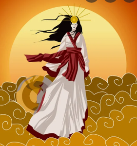

# Amaterasu 

Amaterasu is the goddess of Sun in Japanese mythology.

_ _ _

## Origins

The Sun is governed by celestial beings. The gods, Izanagi and Izunami shaped what would become our Earth. Amaterasu herself was born from Izanami's left eye. 

Amaterasu's younger brother, the Storm God, Susanoo, wrecked the world of living. This led to a clash between the siblings. Susanoo, on the verge of defeat, asked Amaterasu to let him observe the world of living for a while. There he pulled off a trick resulting in the death of one of Amaterasu's handmaids. Amaterasu, grieved and gloomy, isolated herself, stripping the world of the light. The blinded gods brought musical instruments and a mirror to the cave where Amaterasu dwelled. They managed to lure her to take a look at her own reflection and cheer her spirits. Amaterasu left the cave, forgave her brother and took a deserved place in the pantheon. [^1]

Japanese Emperors, traditionally, claim the lineage of Amaterasu.

_ _ _

## References

[^1]: https://www.youtube.com/watch?v=RXRfGj_53Eg

