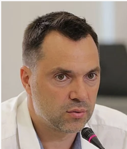

# Arestovich Oleksiy (1975 - )

_ _ _

## Biography

Oleksiy dropped out of a biology faculty of the University of Shevchenko in 1993 to pursue a theatrical career in the Kyiv theatre-studio "Black Square". He performed several roles in movies and also hosted TV shows as a psychologist. 

As for his military career, he allegedly was employed in the Intelligence Agency of Ukraine in 1994-2005 and is a mayor in reserve. 

In 2000s, he allegedly supported the "Eurasianist" ideas of Aleksandr Dugin and stood against the Orange Revolution. Starting from 2008, he began to talk about military and political affairs, was shortly involved in politics. In 2018-2019 allegedly served as an intelligence officer in Kramatorsk. 

In 2020 he became the speaker of the Ukrainian delegation at the Tripartite Contact Group. Later he was appointed an advisor to the Office of the President. His advent was evaluated negatively as well as positively by the media. 

Arestovich is hailed for his analyses and forecasts. He allegedly foresaw the annexation of Crimea in 2008, advent of Petro Poroshenko and Klichko to power after the Maidan, and Russia's invasion of Ukraine in 2019. He did wrongly assume Poroshenko would win the 2019 elections.

_ _ _

## Political Views

_ _ _ 

## Connected with...

_ _ _

## References

[^1]: https://uk.wikipedia.org/wiki/%D0%90%D1%80%D0%B5%D1%81%D1%82%D0%BE%D0%B2%D0%B8%D1%87_%D0%9E%D0%BB%D0%B5%D0%BA%D1%81%D1%96%D0%B9_%D0%9C%D0%B8%D0%BA%D0%BE%D0%BB%D0%B0%D0%B9%D0%BE%D0%B2%D0%B8%D1%87

