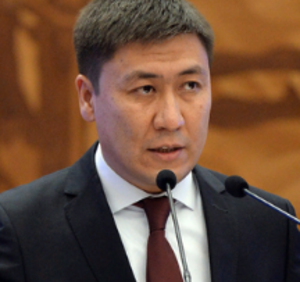

# Beishenaliev Almazbek ()

_ _ _

## Biography

Beishenaliev was a deputy principal of the Vistula University in Warsaw in 2012. Since 2013 lectured as a professor of John Hopkins University. Almazbek has completed an MA in Pedagogy in Ludwigsburg, Germany. 

Beishenaliev was appointed the Minister of Education in October 2020 in [Zhaparov's](zhaparov_sadyr.md) cabinet. Beishenaliev's initial goal was to create a new education system with less paper burden on teachers. Nonetheless, as the Minister, Almazbek introduced a new attestation form for teachers which contributed little to the aforementioned task.

As became known later, Beishenaliev applied for the position of UNESCO's director-general, which he had no official stance to do, as the candidates are proposed by member-countries [^1].

Almazbek left his position at the Ministry in May 2021.

_ _ _

## Political Views

_ _ _ 

## Connected with...

_ _ _

## References

[^1]: https://kloop.kg/blog/2021/05/06/ministrom-obrazovaniya-i-nauki-stal-bolotbek-kupeshev-chto-o-nem-izvestno/
