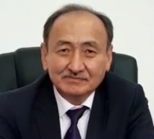

# Beishenaliev Alymkadyr ()

_ _ _

## Biography

_ _ _

## Political Views

_ _ _ 

## Connected with...

Beishenaliev, in an interview, claims his "friendship" with Sadyr Zhaparov started in 2007, when the latter helped finance the erection of Isa Akhunbaev's statue. Per Beishenaliev, there are other 'wealthier' friends, but Zhaparov always helped with opening [hospitals...] and organizing marathons. Beishenaliev adds that he had visited Zhaparov in jail in 2017 after his suicide attempts. As regards the 2020 October events, Beishenaliev tells that Zhaparov guided his closest supporters from within the colony before taking the leadership role after being freed. [^1]

_ _ _

## References

[^1]: https://kloop.kg/blog/2022/01/11/my-pomogli-zhaparovu-vyjti-iz-kolonii-a-on-naznachil-menya-ministrom-bejshenaliev-o-druzhbe-s-prezidentom/?utm_source=rss&utm_medium=rss&utm_campaign=my-pomogli-zhaparovu-vyjti-iz-kolonii-a-on-naznachil-menya-ministrom-bejshenaliev-o-druzhbe-s-prezidentom
[^2]: 
[^3]: 
[^4]: 

