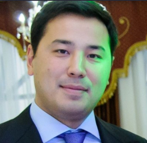

# Dosanov Dimash (1981 - ...)

_ _ _

## Biography

Dosanov Dimash was born in Almaty. He has three diplomas from Kazakh National University n.a.Al-Farabi, Kazakh Economics University n.a.T.Ryskulov, and from the Georgetown University in the US. 

In 2004-2014 Dimash worked in various positions in "KazMunaiGaz", starting from a manager in one of the departments to the general service manager. In 2014-2016 Dimash is the general director of the "Kazakh-Chinese Pipeline". From 2016 employed at "KazTransOil".[^1]

After the January events of 2022 in Kazakhstan was sacked from the position of the general director of "KazTransOil".[^2]
_ _ _

## Political Views

_ _ _ 

## Connected with...

Dosanov is the husband of Alia Nazarbaeva, daughter of the first president of the RK Nursultan Nazarbaev.[^2]

_ _ _

## References

[^1]: https://tengrinews.kz/kazakhstan_news/dosrochno-prekraschenyi-polnomochiya-glavyi-kaztransoyl-459279/
[^2]: https://kloop.kg/blog/2022/01/15/zyatya-nazarbaeva-pokinuli-posty-v-kazahgaz-i-kaztransojl/
[^3]: 
[^4]: 

