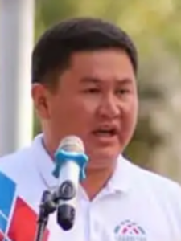

# Talantbek Imanov ()

_ _ _

## Biography

Imanov is originally from the Uch-Kainar village of Issyk-Kul. He graduated from professional technical institution in Karakol as a guide. Later finished his BA in Jurisprudence in KSU n.a. Zh.Balasagyn.

Before 2010 worked as a security member in TNK "Dastan". According to various sources, Imanov was simultaneously a personal driver for Alexey Shirshov, a close crony of Maksim Bakiev with supervision over the energy sector. Imanov 'verified' the fact later giving testimony in relation to the marauding case in 2013 (in the wake of April 2010 turmoil).  

Since 2010 occupied various high-ranking positions in several companies incl. "Gazprom Neft Asia", "Poligon", "Ulan". Since 2020 had been the chairman of "Dastan". 

During the 2020 parliamentary elections, Imanov offered his candidacy with the "Birimdik" party. 

On 6th January, 2022, Imanov was appointed as a person-in-charge of the ministry of digital development. He is expected to occupy the position without the prefix after the approval of the parliament.[^1]
_ _ _

## Political Views

_ _ _ 

## Connected with...

_ _ _

## References

[^1]: https://factcheck.kg/voditel-shirshova-chto-izvestno-o-budushhem-ministre-czifrovogo-razvitiya/?utm_source=rss&utm_medium=rss&utm_campaign=voditel-shirshova-chto-izvestno-o-budushhem-ministre-czifrovogo-razvitiya
[^2]: 
[^3]: 
[^4]: 

