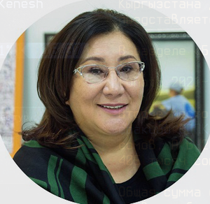

# Isaeva dinara (1960 - ...)



_ _ _

## Biography

Alma-Mater: KSNU, Faculty of Economy.
Short bio:[^1]

```
1984-1995 Accountant at a local branch of "Soyuzpechat"
1995-2007 Entrepreneur, founder of LLC "Asman-Tur"
2007-2010 Deputy of Zhogorku Kenesh
2010-2015 Deputy of ZhK ("Ata-Zhurt")
2015-... Deputy of ZhK ("Ata-Zhurt")
```
Accoring to Kloop, Isaeva was one of the richest deputies of the sixth ZhK. In 2019 and 2020 she earned 137 and 24 million som respectively.[^2] 
_ _ _

## Political Views

_ _ _ 

## Connected with...

- Her ex-husband is [Daniyar Usenov](usenov_daniyar.md), who was a PM during Kurmanbek Bakiev's reign. At the moment, Usenov lives in Belarus under the alias of 'Daniil Uritsky'.
_ _ _

## References

[^1]: <http://www.kenesh.kg/ru/deputy/show/89/isaeva-dinara-shertaevna>
[^2]: <https://kloop.kg/blog/2021/12/07/vladeltsy-restoranov-skota-i-millionov-top-10-samyh-bogatyh-deputatov-shestogo-sozyva/?utm_source=rss&utm_medium=rss&utm_campaign=vladeltsy-restoranov-skota-i-millionov-top-10-samyh-bogatyh-deputatov-shestogo-sozyva>


