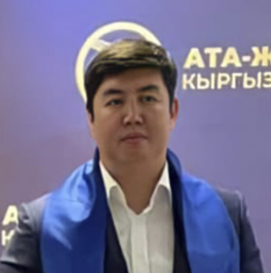

# Ismailov Farkhat ()

_ _ _

## Biography

Ismailov is the founder the companies "Alai Invest" and "Ai-Balta". Ismailov participated in the Osh city council elections in 2012, won but later returned his mandate. In November 2022 elections, Ismailov obtained a mandate as a candidate of "Ata-Zhurt Kyrgyzstan". 

In 2011 a Zh.K. deputy Raikhan Tologonov asked the authorities to inspect Ismailov's alleged membership in an OCG (OPG) of Kamchi Kolbaev.[^1]

_ _ _

## Political Views

_ _ _ 

## Connected with...

Farkhat's brother, Nurbek Ismailov, is a fighter aliased "Klichko". He used to train in a sportclub "Adygine Fighter". In 2017 he and other fighters of the named club were 'monitoring' one of the voting sites in Osh during the presidential elections. They were later accused of assaulting journalists.[^1] 

_ _ _

## References

[^1]: https://kloop.kg/blog/2022/01/12/deputat-farhat-ismailov-priglasil-na-chaj-v-oshe-bolee-700-chelovek-blizkih-i-agitatorov/?utm_source=rss&utm_medium=rss&utm_campaign=deputat-farhat-ismailov-priglasil-na-chaj-v-oshe-bolee-700-chelovek-blizkih-i-agitatorov  
[^2]: 
[^3]: 
[^4]: 

