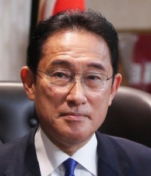

# Kishida Fumio ()

_ _ _

## Biography

- Kishida became the PM of Japan in September 2021 with the support of former PM Abe Shinzo. Shinzo's legacy is still quite influential in Kishida's practices, despite him representing the moderate wing of LDP(Japan) critical of ex-PM's "Abenomics" . [^1]

_ _ _

## Political Views

- Fumio's plan to redistribute wealth has been dubbed as the 'new capitalism'. The critics however call it Japan's 'new prosperity' in analogy to China's policies. Under the criticism's heavy barrage, he had to U-turn his intentions to introduce the capital gains tax (CGT).[^2] 

_ _ _ 

## Connected with...

_ _ _

## References

[^1]: https://www.dw.com/de/parlamentswahl-in-japan-machterhalt-als-minimalziel/a-59640549?maca=de-rss-de-all-1119-xml-mrss
[^2]: https://www.bbc.co.uk/news/business-58976987?at_medium=RSS&at_campaign=KARANGA
