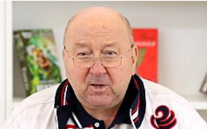

# Korzhakov Alexander (1950 - )

_ _ _

## Biography

Korzhakov was born in 1950 in Moscow. Korzhakov worked in 1970-1989 in the Ninth Department of KGB. In 1985 he becomes one of Boris Yeltsin's personal bodyguards. In 1989 he was fired due to his loyalty to Yeltsin.[^2]

Soldatov, an investigative journalist, describes Korzhakov as a 'general with narrow views but vaulting ambitions'. Korzhakov was loyal to Yeltsin, so he was appointed the head of the presidential security service.[^1]

In 1993, during the power crisis, supported Yeltsin and personally arrested Hasbulatov and Rutskoy. Korzhakov himself admits pressuring Russian businessman and media magnate Vladimir Gusinsky to leave Russia upon the request by Yeltsin. 

Later, Korzhakov left the secret service and started criticizing the first president's suite, albeit without touching Yeltsin himself. 

In 2003-2011 Korzhakov sits in the State Duma per the "United Russia" quote.

Korzhakov's image as the presidential security service head was widely circulated and became popular in media and art.[^2]

_ _ _

## Political Views

_ _ _ 

## Connected with...

_ _ _

## References

[^1]: Soldatov, Andrei, and Irina Borogan. 2011. *The New Nobility: The Restoration of Russia’s Security State and the Enduring Legacy of the KGB*. New York, NY: PublicAffairs.
[^2]: https://ru.wikipedia.org/wiki/%D0%9A%D0%BE%D1%80%D0%B6%D0%B0%D0%BA%D0%BE%D0%B2,_%D0%90%D0%BB%D0%B5%D0%BA%D1%81%D0%B0%D0%BD%D0%B4%D1%80_%D0%92%D0%B0%D1%81%D0%B8%D0%BB%D1%8C%D0%B5%D0%B2%D0%B8%D1%87

