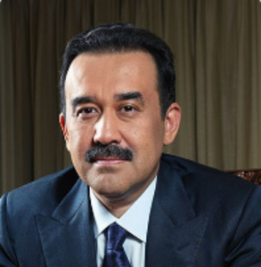

# Masim Karimov (1965 - )

_ _ _

## Biography

Karim Masimov was born in 1965 in Tselinograd (Astana). Masimov graduated from the University of People's Friendship in Moscow in 1988. Later continued his education in various institutions, most notably in China and US. 

During the 1990s worked in commercial structures (several banks). Until 2007 occupied several important positions in and around the Cabinet. In 2007-2012 and 2014-2016 was the head of the government. Since 2016 had worked as the Chairman of KNB. [^1]

Masimov was dismissed from his position in January 2022 during the mass protests across Kazakhstan.

_ _ _

## Political Views

_ _ _ 

## Connected with...

_ _ _

## References

[^1]: https://www.gov.kz/memleket/entities/knb/about/structure/people/16?lang=ru 

