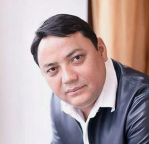

# Matraimov Raimbek

_ _ _

## Biography

Rayimbek Matraimov was a government official working in the customs in 1997-2017. Specifically in the period of 2015-2017 he was the deputy head of the Customs Service. He became notoriously known as one of the richest former officials. The public discontent about the inability of the government to persecute Matraimov even became a crucial factor in the October events of 2020.  

The discontent grew as in May 2019, Azattyk journalist Ali Toktakunov conducted and published an investigation about Matraimov's illicit wealth. 

There is a circulating audiorecording of the conversation between Beknazarov and Atambaev, where they claim Matraimov had to pay 400 000$ to keep his post as a deputy head of customs [^2]. 

Matraimov owns many properties in Bishkek and Osh, including a huge apartment at the Korona complex where also a former head of customs Kubanychbek Kulmatov lives [^3]. 

After the October events of 2021 Matraimov was detained and had to pay approx. 2 billion soms after agreeing to cooperate with the investigation process. In February 2021 he was sentenced to a fine of 260 000 som and left at large. Two other people were sentenced in relation to this case - Nurlan Razhabalaiyev and Abdybahab Boronbayev. Both of them paid a similar fine and compensated 12 and 8 million som respectively. 

Matraimov was included in the Magnitsky sanctions list by the US in December 2020 as well as his spouse - Uulkan Turgunova. The circulating information has it that the couple changed their surnames to Ismailov and Sulaimanova respectively [^4]. 

_ _ _ 

## Connections

Sharabiddin Maripov is known to be his so-called 'right hand' [^1]. 

Fakty.kg reports that in 2012 his brother Tilek  became the akim of Kara-Suu due to the bribing and intimidation of local deputies. The head of aiyl okmotu Sarai did not support Tilek's policies and was replaced with more loyal Zamir Turgunov. This allegedly happened under the negligence of the then-deputy head of GSBEP in Osh [Tairov Bakir](tairov_bakir.md). The newspaper also claims that in 2016 Zhunushaliev tried to dismiss Tairov, but the latter was allegedly saved by Matraimov, who was by then already in the clique of Ilmiyanov, Atambaev's 'gray cardinal' [^5]. 

Matraimov's brother, [Ismail Matraimov](matraimov_ismail.md) , is an MP (since 2015). 

_ _ _

## References:
[^1]: https://www.youtube.com/watch?v=B0GeLAoO70Q 5:25. 
[^2]: https://www.youtube.com/watch?v=B0GeLAoO70Q 7.40
[^3]: https://www.youtube.com/watch?v=B0GeLAoO70Q 10.00
[^4]: https://rus.azattyk.org/a/gknb-sledstvie-v-otnoshenii-matraimova-budet-prodolzheno-v-sluchae-obnaruzheniya-u-nego-imuschestva-za-rubezhom/31103269.html
[^5]: https://www.gezitter.org/society/80625_kak_bakir_tairov_prevratilsya_v_podruchnogo_malchika_raima_matraimova/
