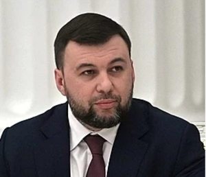

# Pushilin Denis (1981 - ...)

_ _ _

## Biography

Pushilin was born in 1981 in Makeevko (then Ukrainian SSR). He studied at the Donbass National Academy of Construction and Architecture but didn't manage to graduate. In 2011-2013 Pushilin was an active member of the "MMM" financial pyramid (of Sergei Mavrodi). In 2014 Denis became the chairman of the Presidium of the Supreme Council of DNR - a post he occupied for several months. After that, he becomes a DNR deputy, and later its representative at TCG in Minsk. In 2015 Pushilin became the speaker of the People's Council. In 2018 he was elected the head of the republic. 

With the breakout of the Eastern Ukraine events, Pushilin was included in the sanctions list of the EU and several other countries.[^1]

_ _ _

## Political Views

_ _ _ 

## Connected with...

Pushilin is believed to be tightly connected with Russian government. Igor Strelkov claimed Pushilin was not the people's leader, he allegedly had no credibility among the masses. [^1]
_ _ _

## Links

[Pushilin's VK page](https://vk.com/pushilindenis)

_ _ _

## References

[^1]: https://ru.wikipedia.org/wiki/%D0%9F%D1%83%D1%88%D0%B8%D0%BB%D0%B8%D0%BD,_%D0%94%D0%B5%D0%BD%D0%B8%D1%81_%D0%92%D0%BB%D0%B0%D0%B4%D0%B8%D0%BC%D0%B8%D1%80%D0%BE%D0%B2%D0%B8%D1%87

