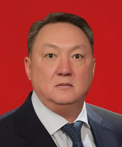
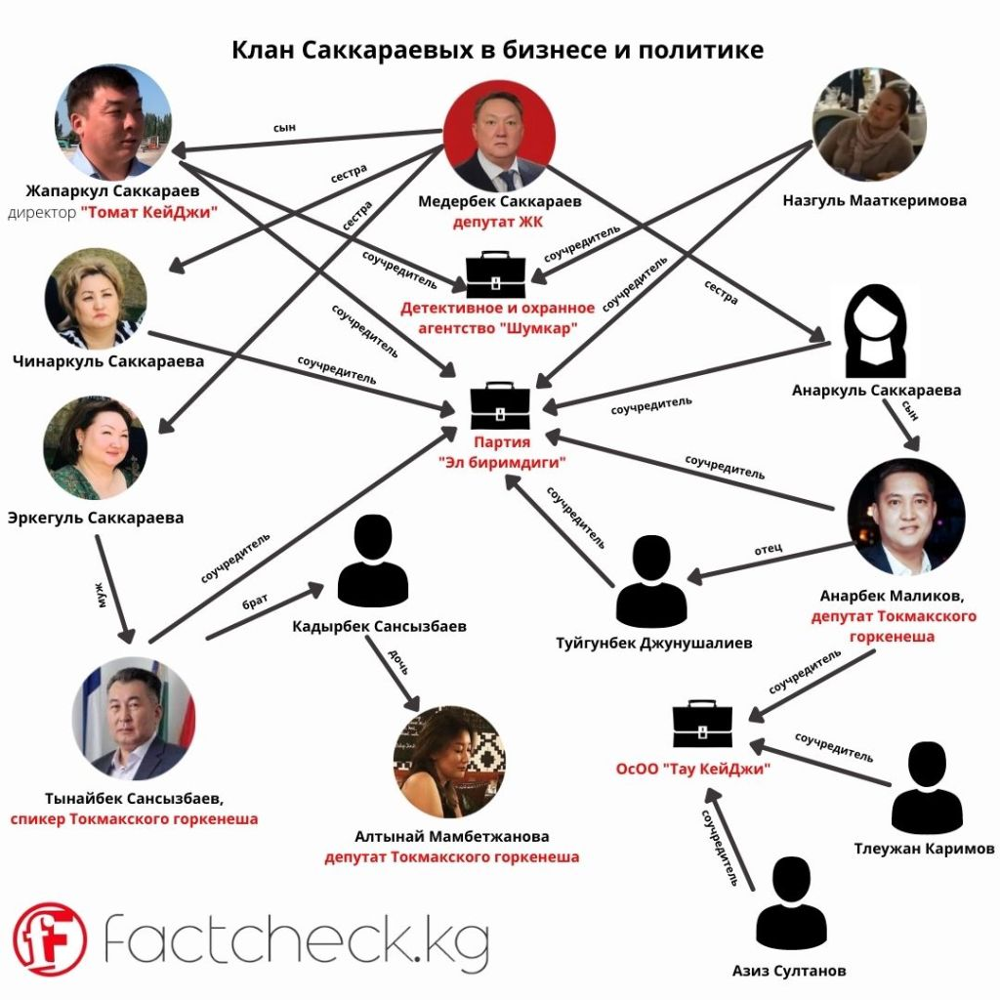

# Mederbek Sakkaraev ()

_ _ _

## Biography

Sakkaraev was elected to the parliament in November 2021 from the Chui-Kemin voting district. 

_ _ _

## Political Views

_ _ _ 

## Connected with...

Sakkaraev's son, Zhaparkul, is the co-founder of a security agency "Shumkar" (registered in Tokmak) along with his mother - Nazgul Maatkerimova. Zhaparkul, also owns an agricultural firm "Tomat KG" - which paid 11 mln som of taxes in 2021. 

Sakkaraev's nephew, Aibek Zhunushaliev, was the head of LLC "Brent" specialised in petroleum and oil related business. 

The party "El birimdigi" which has (as of 2022) 4 chairs in Tokmak city council, is owned by or tied to Sakkaraev's close relatives - Anarbek Malikov (niece), Taalaibek Sansyzbaev (brother-in-law). Other relatives of Sakkaraev also sit in Tokmak city council or have otherwise enterprises running: [^1]

 [^1]

_ _ _

## References

[^1]: https://factcheck.kg/klan-sakkaraevyh-v-politike-i-biznese-chto-izvestno-o-novom-deputate-zhk/?utm_source=rss&utm_medium=rss&utm_campaign=klan-sakkaraevyh-v-politike-i-biznese-chto-izvestno-o-novom-deputate-zhk
[^2]: 
[^3]: 
[^4]: 

