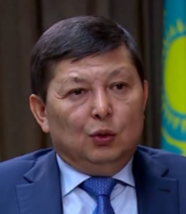

# Sharipbaev Kairat (1963 - ...)

_ _ _

## Biography

Kairat was born in Akterek village in Zhambul. He graduated from Kazakh Agricultural Institute in 1985 and Almaty State University n.a. Abai in 1999. 

In 1985-1993 Kairat worked in agricultural sector, later engaged in entrepreneurship until 1999. Since 2003 has been occupying high-ranking positions in several state oil companies including "KazGasTrans", "KazMunaiGaz", "QazaqGaz".[^1]

After the January events of 2022 in Kazakhstan, Sharipbaev was removed from the chairmanship of "QazaqGaz".[^2]
_ _ _

## Political Views

Kairat is a member of the political council of the "NurOtan" party.[^1]
_ _ _ 

## Connected with...

According to some sources, Kairat is the husband of Dariga Nazarbaeva.[^2]
_ _ _

## References

[^1]: https://online.zakon.kz/Document/?doc_id=31491640&pos=11;-41#pos=11;-41
[^2]: https://kloop.kg/blog/2022/01/15/zyatya-nazarbaeva-pokinuli-posty-v-kazahgaz-i-kaztransojl/
[^3]: 
[^4]: 

