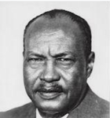
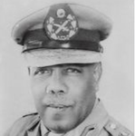

## Military coups in Sudan

November 1958 coup happened under the leadership of General Ibrahim Abboud at a turbulent political period and was encouraged by the sitting PM - Abdalla Khalil. The former came to power in 1956 when the first post-Independence cabinet collapsed. 

At the time, cotton was **the** main export product and GDP constituent. When the discontent cotton workers went on strike the state responded with violence. In 1956-58 the price of cotton decreased dramatically hitting Sudan's budgetary plans. Abdallah Khalil wanted to ask the US for economic and military aid which sparked resistance from opposition. The PM asked the military to step in in 1958. The junta of Ibrahim Abboud managed to increase cotton production increasing domestic exploitation [^1]. 

- [ ] `   Finish rendering the spectre article`

|  
--|--
Abdallah Khalil | Ibrahim Abboud

_ _ _

## Glossary

_ _ _

## References

[^1]: [El-Gizouli, Magdi. 2021. “Counterrevolution in Sudan: A History of Military Coups and Mass Struggle.” *Spectre*, July 11, 2021.](https://spectrejournal.com/counterrevolution-in-sudan/)
