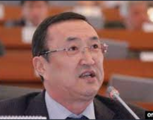

# Sulaimanov Nurlan ()

_ _ _

## Biography

Sulaimanov occupied the post of the minister of transportation during the reign of Kurmanbek Bakiev, having been working in that sphere before. After the April Revolution, Nurlan gets elected to the parliament with the "Ata-Zhurt" political party.[^2]

In 2012 Sulaimanov was charged with office mishandling. He allegedly gave tender lots to the affiliated companies. However, he was not held responsible - Nurlan flew to Germany and 'disappeared'. In 2016 Sulaimanov's case was closed due to expiration date. But in October 2020 he was already participating in parliamentary elections with [Kyrgyzstan party](PP_Kyrgyzstan.md) [^1].

In January 2022, the Cabinet held a meeting in the Ministry of Transportation. An official photo of the showed one of the participants' face being artificially blurred. A table sign reads "Sulaimanov". The press service of the government blamed the camera's focus.[^2]

_ _ _

## Political Views

_ _ _

## Personal connections

Nurlain Sulaimanov's son, Eldar, is a businessman who founded (or co-founded) several companies in the fields of transportation, healthcare, and construction. Eldar himself told in an interview about his water producing business, agricultural endeavours and ownership of a spa complex.[^2] 

_ _ _

## References

[^1]:  https://factcheck.kg/kak-chinovniki-kyrgyzstana-izbegayut-ugolovnoj-otvetstvennosti-rassledovanie-kloop-kg/?utm_source=rss&utm_medium=rss&utm_campaign=kak-chinovniki-kyrgyzstana-izbegayut-ugolovnoj-otvetstvennosti-rassledovanie-kloop-kg  
[^2]: https://factcheck.kg/liczo-ranee-razyskivaemogo-sulajmanova-na-fotografii-ne-v-fokuse-ili-speczialno-razmyto-faktchek/?utm_source=rss&utm_medium=rss&utm_campaign=liczo-ranee-razyskivaemogo-sulajmanova-na-fotografii-ne-v-fokuse-ili-speczialno-razmyto-faktchek

