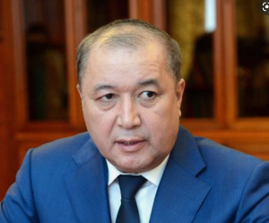

# Tairov Bakir (1966 - )

_ _ _

## Biography

In 2020, right before the parliamentary elections, Tairov threatened the head of Cadastre Agency [Kanybek Botobaev](botobaev_kanybek.md) with firing, unless the personnel contributes funds for the election campaign of ["Birimdik"](PP_Birimdik.md). The latter gathered 14 000 USD and handed over to Tairov. 

The court declared Tairov guilty and fined him 265 000 som, in addition to 14 000 USD he paid back as a 'voluntary contribution' [^1]. 

_ _ _

## Political Views

_ _ _ 

## Connected with...

_ _ _

## References

[^1]: https://factcheck.kg/kak-chinovniki-kyrgyzstana-izbegayut-ugolovnoj-otvetstvennosti-rassledovanie-kloop-kg/?utm_source=rss&utm_medium=rss&utm_campaign=kak-chinovniki-kyrgyzstana-izbegayut-ugolovnoj-otvetstvennosti-rassledovanie-kloop-kg

