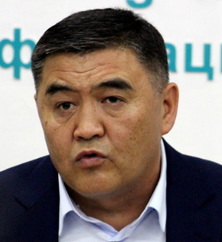

# Kamchybek Tashiev ()

_ _ _

## Biography

- In December, 2021, Tashiev became one of the members of the Anti-Corruption business council.[^2]

_ _ _

## Political Views

_ _ _ 

## Connected with...

- According to Temirov Live, Syrgabayev Absattar appointed the head of the Dzhalal-Abad region, is the 'anointed son' of Tashiev.
- His son, Tashiev Taimuraz, was a deputy of the Dzhalal-Abad city council for a brief time.[^1] 
_ _ _

## References

[^1]: https://kloop.kg/blog/2021/10/29/temirov-live-rukovoditel-severo-vostochnoj-tamozhni-svat-akylbeka-zhaparova/?utm_source=rss&utm_medium=rss&utm_campaign=temirov-live-rukovoditel-severo-vostochnoj-tamozhni-svat-akylbeka-zhaparova
[^2]: https://rus.azattyk.org/a/31597174.html
