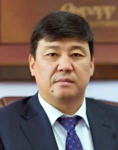

# Torobaev Bakyt ()

_ _ _

## Biography

Torobaev Bakyt was elected to the VII Zhogorku Kenesh. He became the leader of the most populous faction in the parliament - "Ata-Zhurt Kyrgyzstan".  

_ _ _

## Political Views

_ _ _ 

## Connected with...

_ _ _

## References

[^1]: https://rus.azattyk.org/a/deputat-shairbek-tashiev-zayavil-chto-ne-budet-polzovatsya-vliyaniem-brata/31631155.html

