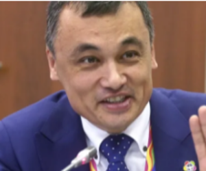

# Askar Umarov ()

_ _ _

## Biography

After the January events of 2022, Umarov was appointed the new Minister of Information. This move created a resonance in Kazakh and Russian societies as he had been previously pretty critical of Russian culture and minority.[^1]

_ _ _

## Political Views

_ _ _ 

## Connected with...

_ _ _

## References

[^1]: https://novayagazeta.ru/articles/2022/01/13/russkii-vopros-uzkii
[^2]: 
[^3]: 
[^4]: 

