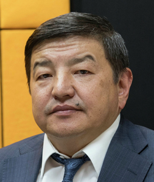

# Zhaparov Akylbek ()


_ _ _

## Biography

Born in 1964 in Balykchy. Earlier career: 

```
1992-1993 - head of the dept of youth polices in the President's Office
1993-1995 - head of the SDPK's Office;
1995-1996 - asssitant of the vice PM;
1996-1997 a member of National Securities Commission;
1997-2000 - Chief Tax Inspector; 
2000-2005 an MP;
2005-2007 - Minister of Economy;
2007-2009 - Minister of economic development; 
2010-2011 - an MP;
2011-2012 - Minister of Finance; 
Since 2015 - an MP from Bir Bol; 
```
 
In 2017, Zhaparov along with [Igor Chudinov](chudinov_igor.md) were accused of corruption during their tenures in the government in 2009-2015. They allegedly allocated a loan to the "Mashinostroitelnaya Stantsiya" company[^2].

Zhaparov was one of the supporters of Kyrgyzstan's joining to the HIPC program[^3] 

During the initial protests in Talas in 2010 almost got caught by the protesters. According to his own words, he got saved due to his little brother who replaced him and went to meet the protesters[^4] 

In October 2020, GSBEP opened a case for tax evasion on companies, owned by Zhaparov's wife. As of December 2020, 28 mln som of damage was restored[^5] 

After the October events of 2020, Zhaparov became an avid supporter of Sadyr Zhaparov, specifically, on the question of Kumtor. Later, in May 2021, Zhaparov as a representative of the parliamentary commission, read out the KR's allegations, including fining the company for over 3 bln $USD[^6] 


_ _ _

## Political Views

_ _ _ 

## Connected with...

According to Temirov Live, [Nurbek Alimov](alimov_nurbek.md), the head of the Nort-Eastern customs, is Zhaparov's in-law (kuda). Zhaparov's brother [Rahatbek Zhaparov](zhaparov_rahatbek.md) is the deputy head of GSIN (penitentiary), his wife is Nurgul Alimova, whose brother is Nurbek.[^1]

_ _ _

## References

[^1]: <https://kloop.kg/blog/2021/10/29/temirov-live-rukovoditel-severo-vostochnoj-tamozhni-svat-akylbeka-zhaparova/?utm_source=rss&utm_medium=rss&utm_campaign=temirov-live-rukovoditel-severo-vostochnoj-tamozhni-svat-akylbeka-zhaparova>
[^2]: <https://ru.sputnik.kg/politics/20170530/1033600985/ugolovnoe-delo-v-otnoshenii-chudinova-i-zhaparova.html>
[^3]: <https://centrasia.org/person2.php?st=1014033807.> 
[^4]: <https://www.youtube.com/watch?v=2mInbpUmdE4&list=PLmgshWOWwJQjiBYlQoPjTzHojE_nMG7q&index=20>
[^5]: <https://rus.azattyk.org/a/30993258.html>
[^6]: <https://rus.azattyk.org/a/31256412.html> 
