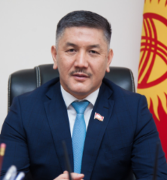

# Zulpukarov Torobai (1974 - )



_ _ _

## Biography

Z.T. was born in 1974 in Nookat (Osh).

Short career overview:[^1]

```
1998-2010 Private entrepreneur
2010-2015 Member of parliament (SDPK), as well as the Law Enforcement Committee
  - 2012-2015 Deputy Speaker
2015-... Member of parliament (SDPK)
```
Zulpukarov was detained on May 31, 2021 in relation to the Kumtor's case along with Asylbek Zheenbekov. On December 8, 2021, Zhogorku Kenesh refused to strip Zulpukarov and others of their immunity.[^2] 

_ _ _

## Political Views

_ _ _ 

## Connected with...

_ _ _

## References

[^1]: <http://www.kenesh.kg/ru/deputy/show/18/zulpukarov-torobay-zakirovich>
[^2]: <https://rus.azattyk.org/a/31599103.html>
